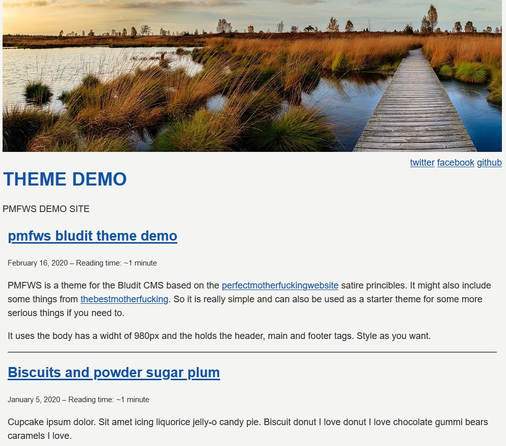

# PMFWS

This is a theme made for the [bludit] cms system by [Diego Najar][bludit]

This theme is a simple theme without much styling. Just use, what the browser offers to you.

A DEMO can been seen here: https://blthemes.zn80.net/pmfws/

Inspired by the
- [motherfuckingwebsite][w1]
- [bettermotherfuckingwebsite][w2]
- [perfectmotherfuckingwebsite][w3]

Thank you!

## General Information

The theme links to a static page called "impressum". This should contain your
"Impressum" (German) / Imprint and the legal stuff like the GDPR things.
If you don't like this, go into the *php/footer.php* file and remove the line
from the first section of the file.

This theme contains a header image which can be changed in the *php/header.php* file.
It is directly at the beginning. If you have a new image, place it into the *img* folder
of the theme here and change the filename in the *php/header.php*

The Social Media Links are dynamic from the admin panel. If there are more
social media options, we need to update the theme accordingly.

## Plugins

This theme does not use any special plugins.

## Header Image

Header image *"belgium bog sunset"* from pixabay: [herbert2512][1]
Header image *nature* from pixabay: [gellinger][2]

## Screenshot

[bludit]:https://www.bludit.com
[1]: https://pixabay.com/de/sonnenuntergang-moor-venn-belgien-2847548/
[2]: https://pixabay.com/de/natur-landschaft-herbst-2813487/
[w1]: https://www.motherfuckingwebsite.com
[w2]: http://www.bettermotherfuckingwebsite.com
[w3]: http://www.perfectmotherfuckingwebsite.com
[CB-MASTODON-LINK]: https://git.tchncs.de/cblte/bludit-plugin-cb-mastodon-link
